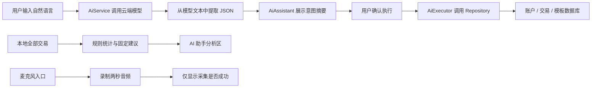
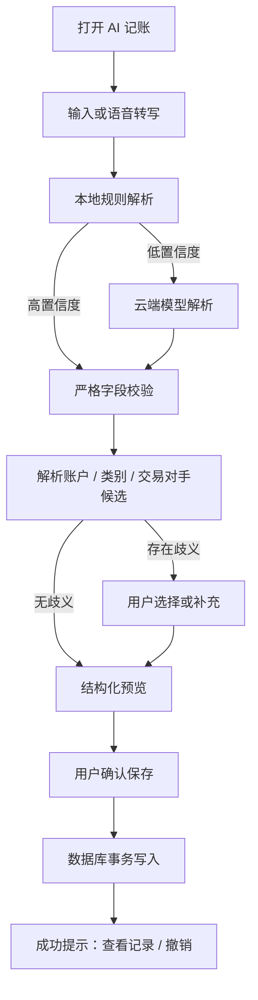

# 开支助手 AI 功能与 UI 完整改造报告

> **报告日期**：2026-08-16（改造与首轮体验始于 2026-08-15）  
> **评估对象**：HarmonyOS `arkts_new` 当前工作区与 Pura 90 6.1.1(24) 模拟器运行版本  
> **应用包名**：`org.totschnig.myexpenses`  
> **报告状态**：实施完成与验收稿  
> **本次范围**：AI 助手入口、自然语言记账、AI 意图执行、消费分析、语音入口、数据准确性、安全与隐私、测试与上线策略  
> **本次操作**：完成体验、审查、代码改造、自动化测试与模拟器回归；验收过程中未确认执行 AI 写账，未改变模拟器账务数据

---

## 0. 本次改造落地结果（2026-08-15—16）

### 0.1 结论

本次已经把原先偏演示性质、存在安全与统计风险的 AI 功能，收敛为一个可以交付验证的安全 MVP：

- “一句话记账”优先在设备本地解析，不依赖模型网络，也不向外部发送简单记账文本。
- 当前只允许单笔收入和单笔支出创建；编辑、删除、转账、拆分、导出、周期任务和多步骤操作均明确拦截。
- 所有写入先展示结构化待确认账单，用户可以检查和修改收支类型、金额、账户、分类、备注、日期；只有再次点击确认才会写库。
- 原始 AiIntent 不能直接写账；只有包含精确账户、日期、币种、币种精度和最小单位金额的“已确认计划”可以进入写入路径。
- 执行器入口设置第二道安全校验，并重新核对账户、币种、分类和字段白名单；即使未来其他页面绕过当前 UI，也不能把原始模型结果直接写库。
- 消费洞察完全在本地计算，明确显示统计范围和“本地计算”标签；转账被排除，拆分父子记录使用不同统计口径，避免父子重复累计。
- 多币种不再无汇率直接相加，而是按币种分别查看。
- 未完成的录音演示入口已经从 AI 页面隐藏，麦克风权限也已移除。
- AI 入口改为鸿蒙原生 ArkUI 文字胶囊按钮，并在“更多”菜单增加稳定入口；当前账户上下文会随导航带入。

界面实现使用 ArkUI 原生组件，包括 PageHeader、Column、Row、Scroll、Button、TextInput、Select、Progress、DatePickerDialog 和 CustomDialogController。没有使用 WebView、HTML/CSS 页面或第三方 UI 框架。

### 0.2 改造前后对比

| 维度 | 改造前 | 本次落地后 | 状态 |
|---|---|---|---|
| 模型密钥 | 客户端内置供应商密钥并直接请求模型接口 | 客户端密钥和供应商 Authorization 已移除；可信业务后端地址默认留空 | 客户端完成，旧密钥仍需外部轮换 |
| 简单记账 | 所有表达依赖云端模型 | “午饭35元”“工资到账8000元”等简单单笔收支本地解析 | 已完成 |
| 复杂表达 | 可能进入不完整或危险执行链 | 未配置可信后端时明确提示能力边界，不猜测、不误写 | 已完成 |
| 写操作边界 | 可进入编辑、删除、拆分、多步骤等高风险逻辑 | 白名单只放行安全动作，危险动作在执行器访问仓库前拦截 | 已完成 |
| 写入确认 | 摘要式预览，关键字段不可完整校对 | 结构化预览 + 原生校对弹窗 + 二次确认 | 已完成 |
| 账户选择 | 可能静默使用默认账户 | 带入当前账户上下文，预览中明确展示并允许选择 | 已完成 |
| 类别与备注 | 调整备注可能同时污染类别 | 类别与备注分离编辑 | 已完成 |
| 时间字段 | 预览和调整不完整 | 展示并可通过原生日期选择器修改 | 已完成 |
| 洞察总额 | 拆分父子记录可能重复统计 | 总额统计主交易，分类统计普通交易与拆分子项，排除转账 | 已完成 |
| 时间范围 | 全量历史与“本月”措辞可能不一致 | 本自然月总览 + 近三个月趋势，边界采用左闭右开区间 | 已完成 |
| 多币种 | 可能直接混合加总 | 按币种分组切换，明确不做无汇率加总 | 已完成 |
| 建议可信度 | 固定规则可能被误解为模型建议 | 改为“智能提示”，明确由本地规则生成、仅供参考 | 已完成 |
| 语音 | 只有两秒录音验证，没有 ASR | 页面不展示语音入口，移除麦克风权限 | 已完成 |
| AI 入口 | 图形含义接近扫码或其他工具 | 顶栏原生“AI”胶囊按钮 + 更多菜单文字入口 + 无障碍说明 | 已完成 |
| 自动化验证 | 缺少安全、解析、统计专项测试 | 新增并注册解析、确认计划、执行安全和洞察专项用例；最终全量 56 条全部通过 | 已完成 |

### 0.3 最终用户流程

#### 一句话记账

1. 用户从交易页顶部“AI”按钮或“更多 → AI 记账与洞察”进入。
2. 页面默认处于“一句话记账”，输入“午饭35元”或点击示例。
3. 本地解析器仅在表达含明确金额证据或记账方向、且不含否定、疑问、提醒、未来/相对日期、账户、外币或危险动作时生成结构化意图；低置信度表达退出本地路径。
4. 页面显示待确认账单：类型、金额、账户、分类、备注和日期。
5. 用户可打开原生校对弹窗修改全部关键字段。
6. 用户点击“确认记入账本”后，UI 把预览转换为封闭的确认计划；执行器校验 schema、精确账户、日期、币种、小数位、分类、备注和未知字段，再把主单位精确换算为最小货币单位。
7. 只有 Repository 返回有效交易编号时，页面才显示成功、清空输入并刷新洞察；无账户、账户失效、币种变化或写入失败不会误报“已记入账本”。
7. 成功后清空待确认状态、显示结果并刷新本地洞察。

整个识别和校对过程不会提前写库。本次模拟器验收为保护既有数据，只验证到待确认和校对阶段，没有点击最终确认。

#### 危险或超范围请求

以“删除午饭35元”为例：

1. 本地解析器发现“删除”标记，不把它误识别成一笔新的 35 元支出。
2. 当前未配置可信业务后端，页面直接显示能力边界说明。
3. 即使调用方手工构造 delete、edit、split、export 或 steps 意图，执行器仍会在仓库访问前返回“暂未执行”。

#### 消费洞察

1. 用户切换到“消费洞察”。
2. 页面按进入时的账户上下文读取数据；从聚合入口进入时可以查看全部账户。
3. 交易先按币种分组，再分别计算本月收入、支出、结余、近三个月趋势和分类分布。
4. 转账不计入收支；拆分父记录只计入总额，拆分子项只用于分类归属。
5. 页面明确显示范围、币种、本地计算属性及规则提示来源。

### 0.4 安全设计

本次采用五层防护：

1. **输入层**：本地解析器采用保守语法，检测危险、查询、周期、拆分、转账、否定、未完成、提醒、相对日期、账户/币种上下文、多数字、超精度和超大金额，不将其降级猜成普通支出。
2. **服务层**：简单表达本地处理；复杂表达只有在明确配置可信业务后端后才可转发。客户端不携带模型供应商密钥。
3. **校验层**：AiIntentValidator 统一校验领域、动作、步骤、拆分项、收支类型、正金额和创建字段白名单；payee、文本类别等未预览字段会直接拒绝。
4. **确认计划层**：原始 create 意图永远不能通过 AiExecutor.execute 写库；UI 明确确认后才构造固定 schema 的 ConfirmedTransactionPlan。
5. **执行层**：AiExecutor.executeConfirmed 在写入前重新读取精确账户与分类，核对币种及小数位，以十进制字符串换算最小单位；不补首账户、当前日期，不模糊匹配实体，也不隐式创建收款人。

需要强调：从当前源码和本次构建产物中移除密钥，并不能让已经暴露过的旧密钥自动失效。密钥撤销、轮换、账单与调用日志审计必须在原模型供应商控制台完成。

### 0.5 洞察口径

| 指标 | 纳入 | 排除 | 展示方式 |
|---|---|---|---|
| 本月收入 | 时间范围内、非转账、非拆分子项、金额为正的主交易 | 转账、拆分子项、范围外数据 | 正数 |
| 本月支出 | 时间范围内、非转账、非拆分子项、金额为负的主交易 | 转账、拆分子项、范围外数据 | 绝对值 |
| 本月结余 | 收入减支出 | 同上 | 可正可负 |
| 月度趋势 | 与总收支相同口径 | 同上 | 按设备本地日历月 |
| 分类分布 | 普通支出主交易 + 拆分子项 | 拆分父记录、转账、收入 | 金额降序，显示金额和占比 |

区间统一使用“起始时间包含、结束时间不包含”。空区间不再生成一个虚假的月份。调用方必须先按币种分组，InsightCalculator 本身不负责汇率换算。

### 0.6 原生 HarmonyOS UI 落地

本次 UI 调整遵循现有应用的 ArkUI 视觉体系：

- 顶栏入口使用原生 Button，采用主题 primaryContainer 背景和 primaryColor 文字，并提供 accessibilityText 与 accessibilityDescription。
- 页面沿用现有 PageHeader，不新增异构导航栏。
- “一句话记账 / 消费洞察”使用原生 Button 组合成分段切换。
- 输入、示例、状态、待确认卡和洞察卡均由 Row、Column、Scroll、Text、TextInput、Progress 组成。
- 账户与分类使用原生 Select；日期使用 DatePickerDialog。
- 校对流程使用 CustomDialogController，不用网页弹层。
- 加载、空数据、失败、能力边界和成功反馈均在页面内呈现；成功另外使用系统 Toast。
- 语音图标不再显示，避免让用户误以为已经具备语音识别能力。

模拟器首次复核时，44vp 的原生 Button 因默认内边距把“AI”显示为省略号；最终将按钮调整为 52vp 并清零额外内边距，二次装机后文字完整显示。这一项属于通过真实设备布局发现并修正的问题。

### 0.7 自动化测试与构建结果

本次新增或纳入以下测试：

- 本地解析：支出、工资/退款收入、普通小数和前导小数。
- 防误识别：删除、查询、周期、拆分、预算、数量/时长、提醒、未完成、否定、疑问、相对日期、显式账户/币种等表达不降级为普通创建。
- 金额边界：拒绝超过本地上限、超出两位小数、量化为零和非安全整数；确认计划覆盖 JPY 零位、常见两位及三位小数换算算法。
- 意图校验：允许单笔收支创建；拒绝未知字段、非法金额、缺少类型、转账、非交易领域、危险动作和多步骤。
- 执行器安全：raw create、危险动作、多步骤在仓库访问前被拦截；假仓库验证拒绝路径零访问，合法计划恰写一次。
- 洞察统计：普通收支、转账排除、拆分父子口径、数据库回读丢失拆分哨兵、普通未分类保护、时间边界、空区间、分类占比、跨年连续月份。

验收结果：

- Hypium：Tests run 56，Failure 0，Error 0，Pass 56，Ignore 0。
- debug HAP：assembleHap 构建成功。
- HAP 安装：模拟器覆盖安装成功，EntryAbility 启动成功。
- 权限：最终包声明 CAMERA 与 INTERNET，不再请求 MICROPHONE。
- 密钥扫描：主源码与最终 HAP 未发现旧供应商地址、Bearer Authorization 或类似模型密钥特征。
- 构建产物：entry/build/default/outputs/default/entry-default-unsigned.hap。

### 0.8 模拟器验收记录

在 Pura 90 6.1.1(24) 模拟器完成以下流程：

| 场景 | 实际结果 |
|---|---|
| 顶部入口 | “AI”文字完整显示，点击进入 AI 页面 |
| 更多菜单入口 | “AI 记账与洞察”显示在原生底部菜单中并可进入 |
| 页面首屏 | 内容从顶部开始布局，无短内容垂直居中的异常空白 |
| 简单支出 | “午饭35元”生成支出 35 元待确认账单 |
| 结构化预览 | 账户、分类、备注、日期、收支类型和金额均可见 |
| 原生校对 | Select 和日期选择可用，账户“123 · CNY”和分类“未分类”正确显示 |
| 危险表达 | “删除午饭35元”不生成预览，显示当前能力边界 |
| 本地洞察 | 本月总览、三个月趋势、分类金额/占比和本地规则提示正常显示 |
| 数据保护 | 未点击最终确认，验收没有新增、修改或删除模拟器交易 |

### 0.9 代码变更范围

核心新增文件：

- entry/src/main/ets/ai/AiIntentCore.ets
- entry/src/main/ets/ai/LocalIntentParser.ets
- entry/src/main/ets/ai/AiIntentValidator.ets
- entry/src/main/ets/ai/AiExecutionPlan.ets
- entry/src/main/ets/ai/InsightCalculator.ets
- entry/src/test/AiIntentCore.test.ets
- entry/src/test/AiExecutorSafety.test.ets
- entry/src/test/InsightCalculator.test.ets

核心修改文件：

- entry/src/main/ets/database/AiService.ets
- entry/src/main/ets/database/AiExecutor.ets
- entry/src/main/ets/pages/AiAssistant.ets
- entry/src/main/ets/pages/Index.ets
- entry/src/main/module.json5
- entry/src/main/resources/base/element/string.json
- entry/src/test/List.test.ets

实施计划：

- docs/superpowers/plans/2026-08-15-ai-safe-mvp.md

### 0.10 仍需后续处理

以下事项没有被伪装成“已完成”：

1. **立即撤销和轮换旧模型密钥**：必须在供应商平台完成；同时审计历史调用、账单和代码历史。
2. **可信 AI 业务后端**：当前 backendUrl 为空。若要恢复复杂自然语言理解，需要服务端身份认证、用户鉴权、限流、审计、字段白名单和超时重试，客户端只访问自有后端。
3. **真实语音识别**：当前不展示语音。只有接入真实 ASR、完成隐私说明、权限时机、失败恢复和真机验证后才应恢复入口。
4. **高级写操作**：编辑、删除、转账、拆分、多步骤和导出仍处于禁用状态。开放前必须实现精确对象选择、二次确认、事务、幂等、回滚和审计。
5. **查询结果 UI**：后续若开放自然语言查账，应使用列表、筛选条件和汇总卡，而不是普通文本结果。
6. **汇率能力**：当前按币种分组展示；若需要跨币种总览，必须引入带日期的可靠汇率和换算依据。
7. **迁移数据完整性**：若旧数据中的拆分父金额与子项合计不一致，分类合计可能与总支出不同。建议增加数据健康检查和修复工具，而不是在展示层静默改数。
8. **三位小数货币目录**：确认计划换算算法已覆盖三位小数测试，但当前全局 CurrencyUnit 清单只有 JPY 为 0 位、其余已知币种为 2 位；KWD、BHD、TND 等需要扩充全局货币元数据后才能作为真实账户币种使用。
9. **休眠语音源码**：未被任何页面引用的 VoiceInputDialog.ets 仍保留在当前脏迁移工作区中。最终 HAP 已将它裁剪且不声明 MICROPHONE；因为该文件在本轮开始前已有用户修改，本次没有擅自删除，后续可在确认无复用需求后单独清理。
10. **非 AI 分布页口径**：既有迁移代码的 Distribution 汇总仍可能同时累计拆分父记录和子记录。AI 洞察已经修复该口径，但分布页属于本轮 AI 范围之外，建议作为独立账务统计缺陷处理。
11. **签名与发布验证**：本次产物为 unsigned debug HAP；正式发布仍需签名、真机、多尺寸、深色模式和无障碍专项验收。

> 说明：后续第 1—15 节保留为“改造前评估基线和完整设计依据”。其中“当前实现”“本次未修改代码”等表述描述的是改造前状态；本节 0 记录最终实际落地和验收结果，优先级高于后续基线描述。

---

## 1. 执行摘要

当前 AI 功能包含三套性质不同的能力：

1. **云端大模型意图识别**：把自然语言转换为账户、交易、模板相关的结构化操作。
2. **本地规则与统计分析**：汇总收支、近三个月趋势、支出分类并生成固定规则建议。
3. **录音采集验证**：申请麦克风权限并录制两秒音频，用于验证麦克风是否可用，尚未接入语音识别。

自然语言记账的产品方向成立。本次在模拟器中输入“午饭35元”，系统能够正确识别为“交易·创建：支出 35 元（午饭）”，并提供预览、调整和确认步骤。这证明“用户用一句话快速记账”可以成为应用的核心增值能力。

但当前版本仍属于**功能验证阶段**，不具备正式上线条件。主要原因不是视觉细节，而是以下几类基础风险：

- 模型服务密钥直接存在于客户端代码中，存在泄露与滥用风险。
- 拆分交易可能在 AI 汇总中被父记录和子记录重复计算，直接影响财务数据正确性。
- 编辑、删除使用模糊关键词匹配第一条记录，存在误改、误删风险。
- 组合操作逐项写库，没有事务和回滚，可能只完成一半。
- AI 校对页面不能校对账户、类别、日期、交易类型等关键字段。
- “备注”编辑值会同时写入“类别”字段，语义错误。
- “AI 建议”实际是本地规则，并且使用全量历史数据，却可能显示“本月”措辞。
- 语音入口没有语音识别能力，却以“AI 语音输入”形式暴露给用户。

因此推荐采用以下总体策略：

> **先把 AI 收敛成可信的“一句话记账 + 账务查询 + 本地消费洞察”，补齐安全与数据准确性后，再逐步开放编辑、删除、组合操作、拆分和导出。**

---

## 2. 评估目标、方法与边界

### 2.1 评估目标

- 判断现有 AI 能力是否解决真实记账需求。
- 验证用户是否能发现、理解、校对并安全执行 AI 操作。
- 核对 AI 展示数据是否与账本数据口径一致。
- 识别正式上线前必须解决的安全、隐私和账务风险。
- 给出可以直接拆分为开发任务的 UI、功能、测试和上线方案。

### 2.2 评估方法

本次采用“模拟器体验 + UI Dump + 源码核对 + 现有测试文档检查”四种方式交叉验证：

- 从账户页进入交易页，定位 AI 助手入口。
- 进入 AI 助手，检查统计、趋势、分类、建议和语音入口。
- 输入“午饭35元”，观察模型识别、预览和要素调整流程。
- 不点击“确认执行”，避免改变现有账务数据。
- 对照 `AiAssistant.ets`、`AiService.ets`、`AiExecutor.ets`、`Repository.ets`、`VoiceInputDialog.ets` 和 `Index.ets` 确认实际能力边界。
- 检查 `migration/function-tests.md` 和 `migration/test-plan-full.md` 中的 AI 测试覆盖情况。

### 2.3 本次未执行的操作

- 未创建、编辑或删除任何账户、交易和模板。
- 未执行组合操作、拆分或导出。
- 未实际申请麦克风权限和录音。
- 未验证真实网络弱网、断网、模型限流和服务端异常。
- 未验证真机语音权限、横屏和深色模式的完整流程。

---

## 3. 当前功能架构与能力清单

### 3.1 当前数据流



### 3.2 当前能力清单

| 能力 | 当前实现 | 完成度判断 | 主要问题 |
|---|---|---:|---|
| 自然语言创建支出/收入 | 云端模型识别后直接构造交易 | 可用原型 | 账户默认取第一项；日期、类别等不可完整校对 |
| 自然语言转账 | 复用 `account`/`payee` 推断目标账户 | 不可靠 | 来源账户和目标账户字段未分离，容易无法执行或选错 |
| 创建账户 | 模型识别名称、货币和类型后写库 | 可用原型 | 缺少起始余额、颜色、是否计入总计等关键字段 |
| 查询账户余额 | 本地查询并返回文本 | 基础可用 | 固定显示“元”，未正确处理多货币 |
| 编辑账户 | 按名称模糊匹配第一项 | 高风险 | 同名或包含关系可能选错账户 |
| 删除账户 | 无交易时允许直接删除 | 高风险 | 匹配不唯一；缺少明确对象卡片和撤销 |
| 查询近期交易 | 返回最多十条文本 | 基础可用 | 缺少跳转、分页和结构化结果 |
| 编辑交易 | 按备注关键字取第一条 | 高风险 | 相同备注交易极常见，可能误改 |
| 删除交易 | 按备注或金额取第一条 | 高风险 | 可能误删；没有候选选择和撤销 |
| 时间/类别筛选 | 生成文本结果 | 体验不完整 | 没有真正改变交易列表筛选状态 |
| 账户排序 | 计算排序后的文本列表 | 体验不完整 | 不改变或持久化账户实际顺序 |
| 拆分交易 | 模型生成子项后写入父子交易 | 高风险 | 未校验子项合计等于用户总金额 |
| 导出 CSV | 写入应用沙箱目录 | 体验不完整 | 用户无法直接打开、分享或定位文件 |
| 模板创建/编辑/删除/使用 | 本地执行 | 可用原型/部分高风险 | 默认第一账户；删除和编辑存在名称歧义 |
| 多操作组合 | 依次执行每个步骤 | 高风险 | 无事务、无回滚、组合操作不能调整要素 |
| 消费分析 | 本地统计全部交易 | 需修正 | 数据口径、拆分交易、多货币、时间范围存在问题 |
| AI 建议 | 固定规则生成文本 | 可用但命名不准确 | 并非模型建议；缺少可操作入口 |
| 语音输入 | 录音采集验证 | 未完成 | 无 ASR、无文本回填、无执行链路 |

---

## 4. 模拟器实际体验记录

### 4.1 入口发现

实际入口位于“交易”页顶部，搜索图标与更多图标之间。当前使用系统“扫描”图标，没有文字、提示或无障碍描述。

用户可能产生三种误解：

- 认为这是二维码或票据扫描。
- 认为这是 OCR 收据功能。
- 完全忽略该图标，不知道应用具有 AI 记账能力。

与此同时，“更多”菜单当前只有预算、交易对手/债务和设置，没有 AI 助手入口。现有迁移文档中“更多→AI 助手”的描述已经与实际版本不一致。

### 4.2 AI 助手首页

页面顶部同时放置“重新分析”和麦克风入口，下方依次是：

1. AI 记账输入；
2. 收入、支出和结余；
3. 近三月趋势；
4. 支出最多类别；
5. AI 建议。

当前页面同时承担“执行命令”和“阅读报表”两个任务，视觉焦点不明确。输入示例是一整行长文本，在模拟器屏幕上已经发生横向截断。分类排行只显示名称，不显示金额，因为 `categoryAmount()` 当前固定返回空字符串。

### 4.3 自然语言识别

测试输入：`午饭35元`

实际结果：`识别为【交易·创建】：支出 35 元（午饭）`

正面表现：

- 意图、收支类型、金额和备注识别正确。
- 识别结果不会立即写库。
- 提供“调整要素”“确认执行”“取消”三个操作。

需要改进：

- 点击识别后键盘没有自动收起。
- 识别结果只是单行摘要，没有展示实际将使用的账户、类别和日期。
- 三个按钮权重过于接近，“取消”和“调整要素”占用大量横向空间。
- “确认执行”没有根据动作风险改变文案和颜色。
- 识别请求没有取消按钮，错误主要通过 Toast 展示。

### 4.4 要素调整

创建交易的调整弹窗只有“金额”和“备注”：

- 不能调整支出/收入/转账类型。
- 不能选择账户。
- 不能选择类别。
- 不能调整日期与时间。
- 不能设置交易对手、付款方式、标签等已有账务字段。
- 输入备注后，代码会把同一个值同时写入 `comment` 和 `category`，导致“午饭”既是备注又被拿去匹配类别。

这意味着用户虽然看到“可以调整”，但仍无法检查最容易出错的账务字段。

### 4.5 语音入口

语音弹窗标题为“AI 语音输入”，提示“点击麦克风开始录音采集验证（2 秒）”。当前实现只验证是否采集到非零音频：

- 没有语音转文字。
- 没有调用 `onResult` 返回识别文本。
- 不会回填 AI 输入框。
- 用户完成录音后无法继续自然语言记账。

因此当前语音入口应视为开发调试工具，不应在正式产品 UI 中显示。

---

## 5. 问题分级与完整修改建议

## 5.1 P0：上线前必须完成

### AI-P0-001 客户端模型密钥暴露

**现状**  
模型服务地址、模型名称和访问密钥直接定义在 `entry/src/main/ets/database/AiService.ets` 的 `AI_CONFIG` 中。

**风险**

- HAP 安装包可被提取和分析，客户端密钥无法真正保密。
- 密钥可能被第三方盗用，产生费用、限流和服务中断。
- 难以进行用户级鉴权、配额、审计和模型切换。
- 一旦密钥进入提交历史，仅删除当前文件中的值并不足够。

**修改方案**

1. 立即撤销并轮换当前密钥。
2. 检查 Git 历史、构建产物、日志和测试证据中是否存在该密钥。
3. 正式环境改为应用调用自有后端代理，由后端持有模型凭据。
4. 后端增加用户鉴权、请求限流、用量上限、超时、审计和模型供应商切换。
5. 开发环境凭据放在仓库外的本机配置中，但不要误认为客户端配置可以用于正式发布。
6. CI 增加密钥扫描，阻止 `sk-` 等敏感凭据进入提交和构建产物。

**验收条件**

- 源码、Git 历史和 HAP 中不再包含可用模型密钥。
- 旧密钥已失效。
- 客户端只持有短期会话凭证或不敏感的后端地址。
- 后端可按用户或设备限制调用频率和每日额度。

---

### AI-P0-002 拆分交易重复统计

**现状**  
交易列表读取时会过滤 `parent_id IS NULL`，但 `getAllTransactions()` 没有过滤父子记录。AI 分析调用 `getAllTransactions()` 后直接累加所有记录。拆分交易由一个父交易和多个子交易组成，因此可能同时计算父记录和全部子项。

**风险**

- 收入、支出、结余、趋势和分类金额可能错误。
- “AI 建议”基于错误金额生成，损害用户对财务产品的信任。
- 同一错误可能影响 Repository 中其他汇总功能。

**修改方案**

- 汇总余额和月度趋势只统计主交易 `parent_id IS NULL`。
- 分类分布若需要子项分类，应只统计拆分子项，同时排除对应父记录；普通交易仍统计主记录。
- 将“余额口径”和“分类口径”拆成两个明确的 Repository 查询，不再共用含义模糊的 `getAllTransactions()`。
- 为普通交易、拆分交易、转账和模板实例化分别建立固定数据夹具。

**验收条件**

- 一笔 100 元、子项 40+60 的拆分交易，在总支出中只计 100 元。
- 分类统计分别显示 40 元和 60 元，总和为 100 元。
- 转账不进入收入与支出，但正确影响来源和目标账户余额。

---

### AI-P0-003 高风险操作对象匹配不安全

**现状**  
账户、交易和模板的编辑、删除普遍使用 `includes()` 模糊匹配，并直接选择找到的第一项。

**风险示例**

- “删除午饭那笔”可能匹配多条午饭记录。
- “修改储蓄”可能同时匹配“储蓄卡”和“储蓄账户”。
- 只按金额匹配时，相同金额的交易非常常见。

**修改方案**

1. 执行器先返回候选对象，不直接修改数据库。
2. 候选唯一且置信度足够时，展示完整对象卡片确认。
3. 候选多于一个时，展示日期、金额、账户、类别和备注列表，让用户选择。
4. 删除默认改为可恢复的软删除，或至少提供短时“撤销”。
5. 禁止对空目标、过短目标或仅金额目标执行删除。

**验收条件**

- 同时存在多条“午饭”记录时，系统必须要求选择，不能自动删除第一条。
- 确认页必须显示最终对象的唯一 ID 对应信息。
- 删除完成后用户可撤销并恢复全部关联数据。

---

### AI-P0-004 组合操作没有事务与回滚

**现状**  
`AiExecutor.execute()` 对 `steps` 逐项调用。前一步成功、后一步失败时，已经完成的数据修改不会回滚。

**修改方案**

- 引入“计划阶段”：先解析、校验和解析所有实体，不写库。
- 把每一步按顺序展示给用户，并标记读取、创建、修改、删除。
- 所有写操作通过数据库事务执行。
- 任一步失败时回滚全部写操作。
- 组合操作第一版建议只支持“多个创建”或“查询 + 创建”；包含删除时暂不开放。

**验收条件**

- 任一步失败后，数据库状态与执行前完全一致。
- 用户可以逐项关闭不希望执行的步骤。
- 组合操作执行前能够调整每一步的字段。

---

### AI-P0-005 模型输出缺少严格校验

**现状**  
客户端通过正则提取模型返回中的第一个 JSON 对象，然后直接转换为 `AiIntent`。没有严格检查字段是否存在、类型是否正确、动作是否在允许列表中、金额是否合理。

**修改方案**

- 使用严格结构化输出或 JSON Schema。
- 在进入执行器前增加独立 `AiIntentValidator`。
- 对 `domain`、`action`、字段类型、金额精度、日期范围、步骤数量和字符串长度做白名单校验。
- 金额统一使用字符串十进制或最小货币单位，避免浮点误差。
- 模型返回未知字段时忽略并记录，不允许其透传到执行层。
- 单次组合操作设置步骤上限，例如最多 5 步。

**建议结构**

```json
{
  "version": 1,
  "intent": "transaction.create",
  "confidence": 0.94,
  "needsClarification": false,
  "fields": {
    "type": "expense",
    "amountMinor": 3500,
    "currency": "CNY",
    "accountName": null,
    "categoryName": "餐饮",
    "payeeName": null,
    "comment": "午饭",
    "occurredAt": null
  },
  "clarificationQuestion": null
}
```

**验收条件**

- 非 JSON、缺字段、类型错误、负数或超大金额均不会进入执行器。
- 未知动作只显示“暂不支持”，不产生数据库写入。
- 所有执行入口都必须经过同一个验证器。

---

## 5.2 P1：核心体验与准确性

### AI-P1-001 重构页面信息架构

**推荐方案：双模式页面**

页面顶部使用分段控制器：

- **一句话记账**：输入、识别、校对、确认、结果。
- **消费洞察**：收支、趋势、分类、预算与建议。

推荐默认进入“一句话记账”，因为它是用户主动打开 AI 助手时最明确的任务。消费洞察保留上次选择或通过首页卡片进入。

不建议继续将两套能力垂直堆叠在同一长页面中，原因是：

- 输入键盘会挤压或遮挡分析内容。
- 写账和看报表属于不同用户任务。
- 执行结果插入后会推动整个分析区下移，页面跳动明显。

---

### AI-P1-002 提升入口可发现性

**修改方案**

- 把交易页扫描图标替换为独立的星光、魔法棒或机器人图标。
- 图标增加无障碍描述“AI 记账”。
- 在交易 FAB 展开菜单中增加“AI 记账”。
- 在“更多”菜单增加“智能助手”，副标题为“一句话记账与消费洞察”。
- 首次使用可展示一次轻量气泡提示，不重复打扰。

**验收条件**

- 未看说明的用户能够判断入口用途。
- UI Dump 中入口具有明确 `description`。
- 入口不与 OCR、扫码或收据扫描共用同一图标。

---

### AI-P1-003 重做输入与示例区域

**当前问题**

- “AI 记账”标题、长示例和输入框挤在一个顶部卡片中。
- 示例单行溢出。
- 按钮仍叫“AI 记账”，与区块标题重复。

**修改方案**

- 标题改为“用一句话记账”。
- 输入框支持 1～3 行，提示文案为“例如：午饭 35 元，从储蓄卡支付”。
- 主按钮改为“识别”或使用输入框内发送按钮。
- 麦克风在真正接入语音识别后放入输入框尾部。
- 示例改为可点击 Chips：
  - `午饭 35 元`
  - `工资到账 8000 元`
  - `从储蓄卡转 500 到现金`
  - `每月房租 2000 元`
- 点击识别后自动收起键盘并滚动到预览卡。

---

### AI-P1-004 使用结构化校对卡替代一句摘要

创建交易至少应展示以下字段：

| 字段 | 展示与校对要求 |
|---|---|
| 类型 | 支出/收入/转账，允许切换 |
| 金额 | 大字号显示，标明货币 |
| 账户 | 默认当前交易页账户；不确定时必须选择 |
| 目标账户 | 仅转账显示，且不能与来源账户相同 |
| 类别 | 显示模型建议；不存在时提供“新建/选择/留空” |
| 日期时间 | 默认当前时间，允许修改 |
| 交易对手 | 可选，不能与备注混用 |
| 付款方式 | 可选，使用应用已有选项 |
| 备注 | 独立字段，不得自动同步到类别 |
| 标签 | 可选，多选 |

低置信度或模型补全字段使用黄色提示，例如“账户未明确，已暂选储蓄卡”。只有所有必填字段合法后才启用确认按钮。

按钮建议：

- 普通创建：`保存这笔交易`
- 查询：不显示确认按钮，直接展示结果
- 编辑：`确认修改`
- 删除：红色 `删除这笔交易`
- 组合：`执行 3 项操作`

---

### AI-P1-005 修复默认账户与转账语义

**当前问题**

- 没有识别到账户时直接使用账户列表第一项。
- 转账来源和目标复用了含义不清的字段。

**修改方案**

- 从交易页进入 AI 时，把当前选中账户作为上下文，而不是全局第一账户。
- 明确字段：`sourceAccountId` 与 `destinationAccountId`。
- 用户只说“转 500 到现金”时，可用当前账户作为来源，但确认卡必须明确显示。
- 用户从“更多”菜单进入、没有账户上下文时，必须要求选择来源账户。
- 目标账户不明确时不得执行转账。

---

### AI-P1-006 修复分析数据口径

**当前问题**

- 收入、支出和结余统计全部历史交易，但规则建议出现“本月”。
- `expense` 是负数，但“无收入时”的判断使用 `expense > 0`，分支无法正常进入。
- 金额符号固定为 `¥`，所有账户按同一货币直接相加。
- 分类列表金额函数返回空字符串。
- 拆分交易可能重复统计。

**修改方案**

1. 增加时间范围：本月、上月、近三月、自定义。
2. 标题明确显示统计范围，例如“本月收支”。
3. 统一使用明确的正数指标：`incomeMinor`、`expenseMinorAbs`、`netMinor`。
4. 多货币默认分币种展示；只有存在可靠汇率时才显示折算总额，并注明基准币种和汇率时间。
5. 保存分类金额 Map，展示金额、占比和条形进度。
6. 区分余额统计口径与分类统计口径，正确处理拆分和转账。

**验收条件**

- 页面所有“本月”文字只使用本月数据。
- 切换时间范围后所有卡片、趋势、分类和建议同步刷新。
- 多货币不会直接相加成一个人民币数字。
- 分类金额之和与对应时间范围总支出一致。

---

### AI-P1-007 将“AI 建议”改为可信的“消费洞察”

本地规则分析具有速度快、离线可用、隐私友好的优势，没有必要伪装成大模型。建议改名为：

- 页面模式：`消费洞察`
- 区块标题：`本地智能建议` 或 `账务提示`
- 说明：`根据本机账本数据计算，不会上传账目明细`

每条建议应包含证据与行动：

| 洞察 | 证据 | 行动按钮 |
|---|---|---|
| 未分类支出过高 | 2085 元，占支出 95.9% | `去补分类` |
| 餐饮支出较高 | 较上月增加 28% | `设置餐饮预算` |
| 本月支出超过收入 | 差额 2150 元 | `查看大额支出` |

没有对比基线时，不要使用“偏高”“异常增长”等判断性措辞。建议至少需要上月或过去三个月数据作为基线。

---

### AI-P1-008 暂时隐藏语音入口

在完整语音链路上线前：

- 从页面头部移除麦克风图标。
- `VoiceInputDialog` 保留为开发调试工具，但不能在 release 构建中暴露。
- 如果产品必须保留入口，应明确标记“录音测试”，不能叫“AI 语音输入”。

正式语音能力应满足：

1. 请求权限前解释用途。
2. 录音时显示计时、波形或明确状态。
3. 支持手动停止和取消。
4. ASR 结果可编辑，并自动回填一句话记账输入框。
5. 用户仍需经过结构化校对与确认，语音不能直接写账。
6. 音频是否上传、保存多久必须在隐私说明中明确。

---

### AI-P1-009 完善错误与加载状态

需要区分以下错误，而不是统一显示原始 JSON：

| 场景 | 用户提示 | 可用操作 |
|---|---|---|
| 无网络 | “网络不可用，暂时无法使用云端识别” | 重试 / 使用普通记账 |
| 请求超时 | “识别时间较长，请重试” | 重试 / 取消 |
| 服务限流 | “今日智能识别次数已用完” | 普通记账 / 稍后再试 |
| 模型格式错误 | “没有理解这句话，请换一种说法” | 修改输入 |
| 缺少金额 | “还需要一个金额” | 直接补充金额 |
| 账户不明确 | “请选择使用哪个账户” | 候选账户列表 |
| 数据库失败 | “保存失败，账本没有发生变化” | 重试 / 返回 |

日志中不得记录密钥、完整授权头、敏感账务文本或服务端完整响应。

---

## 5.3 P2：增强能力

### AI-P2-001 查询结果结构化

余额、近期交易和分类查询不应只返回长文本。建议使用账户卡、交易列表和分类图表，并支持：

- 点击交易进入详情。
- 点击账户进入账户页。
- “在交易页查看全部结果”。
- 保留当前查询条件作为筛选器。

### AI-P2-002 操作历史与撤销

增加“AI 操作记录”，只记录结构化动作和执行状态，不默认保存完整自然语言输入。用户可查看：

- 原始命令摘要。
- 识别结果。
- 实际修改的对象。
- 执行时间。
- 成功、失败、已撤销状态。

### AI-P2-003 本地解析优先

对简单、高频、格式明确的表达使用本地解析：

- `午饭35元`
- `工资8000`
- `打车 26.5`
- `今天买菜 48`

只有在本地解析置信度不足、包含多步骤或复杂歧义时才调用云端模型。这样可以降低延迟、成本和隐私暴露。

### AI-P2-004 无障碍与主题适配

- 所有图标增加文字描述。
- 支持系统字体放大，不依赖单行固定高度。
- 深色模式下弹窗不得硬编码白色背景。
- 错误、收入、支出不能只依赖颜色区分。
- 横屏时输入和预览可采用左右双栏，避免纵向过长。

---

## 6. 推荐的目标用户流程

### 6.1 创建单笔交易



### 6.2 查询类操作

查询不应使用“确认执行”：

1. 用户输入“这个月餐饮花了多少”。
2. 系统解析时间范围和类别。
3. 本地查询数据库。
4. 展示总额、占比、同比/环比（有数据时）及交易明细入口。

### 6.3 编辑和删除

1. 解析目标描述。
2. 查询候选记录。
3. 若多条匹配，必须由用户选择。
4. 展示修改前后对比。
5. 用户明确确认。
6. 事务写入。
7. 提供撤销。

### 6.4 组合操作

组合操作采用“执行计划”而不是一句摘要：

```text
计划执行 2 项操作

1. 删除交易：2026-08-15，咖啡，30 元，储蓄卡
2. 创建支出：餐饮，50 元，储蓄卡，今天

[逐项调整] [取消] [执行 2 项操作]
```

只要其中一个对象不明确，整个计划保持不可执行状态。

---

## 7. 建议的内部架构

### 7.1 模块边界

| 模块 | 单一职责 |
|---|---|
| `AiCommandInput` | 输入、示例、语音转写和请求状态 |
| `LocalIntentParser` | 解析简单高频记账表达 |
| `AiGateway` | 调用自有后端，不持有供应商密钥 |
| `AiIntentValidator` | 严格验证模型输出和字段范围 |
| `EntityResolver` | 将名称解析到账户、类别、模板和交易候选 |
| `ActionRiskClassifier` | 判定只读、创建、修改、删除和组合风险 |
| `AiActionPlanner` | 生成可预览、可校对的执行计划 |
| `AiExecutor` | 只接收已经验证并解析为 ID 的计划 |
| `AiOperationRepository` | 事务、软删除、撤销和操作记录 |
| `InsightService` | 按明确数据口径生成本地洞察 |

### 7.2 执行层约束

执行器不应再接收模糊名称，例如：

```text
错误：delete transaction where comment includes "午饭"
正确：delete transaction id=184 after user confirmed candidate id=184
```

模型负责“理解”，本地代码负责“验证、解析唯一对象和执行”。模型输出永远不能直接成为数据库条件。

### 7.3 动作风险分级

| 风险级别 | 动作 | 默认行为 |
|---|---|---|
| R0 只读 | 查询余额、交易、分类支出 | 校验后直接展示结果 |
| R1 可恢复创建 | 创建交易、使用模板 | 结构化预览后确认，成功后可撤销 |
| R2 修改 | 编辑交易、账户、模板 | 展示修改前后差异，明确确认 |
| R3 删除/批量 | 删除、组合操作、批量修改 | 候选选择、红色确认、事务、可恢复 |
| R4 外部输出 | 导出、分享 | 展示范围、文件格式和目标位置后确认 |

---

## 8. 安全、隐私与合规建议

### 8.1 首次使用说明

建议首次使用云端识别时展示简短说明：

> 为理解你的记账描述，本次输入文字会发送到云端模型服务。账本明细和本地统计默认不会上传。你可以在设置中关闭云端识别，继续使用普通记账和本地消费洞察。

需要在隐私政策中进一步说明：

- 模型服务提供方。
- 上传的数据类型。
- 是否保存请求和响应。
- 保存时长和删除方式。
- 数据是否用于模型训练。
- 用户如何关闭云端能力。

### 8.2 数据最小化

- 当前自然语言识别只需要上传本次输入，不应上传完整账本。
- 实体解析尽量在本地完成，不把全部账户名、交易记录发送给模型。
- 若复杂问题确实需要账本上下文，应先进行字段裁剪和脱敏，并单独告知用户。
- 遥测不记录原始账务文本；只记录意图类型、耗时、成功/失败和匿名错误码。

### 8.3 防滥用

- 后端限制单用户、单设备和单 IP 的调用频率。
- 限制输入长度、组合步骤数和输出长度。
- 对异常调用量、重复失败和密钥滥用告警。
- 服务端不信任客户端传入的模型名称、目标地址或授权信息。

---

## 9. 详细测试方案

### 9.1 单元测试

#### 意图验证

- 正常单笔支出、收入、转账。
- 缺少金额、金额为零、负数、超大金额和超过两位小数。
- 非 JSON、Markdown 包裹 JSON、多 JSON、未知字段和错误类型。
- 未知 domain/action。
- 组合步骤为空、超过上限和嵌套组合。

#### 实体解析

- 精确匹配账户。
- 多个账户包含相同关键字。
- 多条交易备注相同。
- 类别不存在、类别同名、父子类别。
- 模板同名。

#### 数据统计

- 普通支出与收入。
- 转账排除收入支出。
- 拆分交易总额只计算一次。
- 拆分分类按子项统计。
- 月初、月末、跨年和时区边界。
- 多货币分开展示与折算。

### 9.2 集成测试

| 编号 | 场景 | 期望结果 |
|---|---|---|
| AI-IT-01 | 输入“午饭35元” | 生成支出 3500 分，不直接写库 |
| AI-IT-02 | 当前账户为储蓄卡 | 预览默认储蓄卡，不取列表第一账户 |
| AI-IT-03 | 两条午饭记录后请求删除 | 返回两个候选，不执行删除 |
| AI-IT-04 | 组合第二步失败 | 第一步修改回滚 |
| AI-IT-05 | 拆分 100 为 40+60 | 总支出 100，分类合计 100 |
| AI-IT-06 | 拆分 100 为 40+50 | 禁止保存并提示还差 10 |
| AI-IT-07 | 模型超时 | 可取消、可重试、数据库不变 |
| AI-IT-08 | 模型返回非法动作 | 本地拒绝执行 |
| AI-IT-09 | 导出本月账单 | 使用系统文件选择/分享界面得到可访问文件 |
| AI-IT-10 | 删除后点击撤销 | 数据和关联信息恢复 |

### 9.3 UI 测试

- 浅色、深色。
- 竖屏、横屏。
- 默认字体、最大系统字体。
- 键盘展开和收起。
- 空账本、单账户、多账户、多货币。
- 输入、识别中、需要补充、预览、执行中、成功、失败和撤销状态。
- 长文本、超长账户名和超大金额。
- 无障碍描述、焦点顺序和读屏。

### 9.4 安全测试

- 仓库与 HAP 密钥扫描。
- 代理接口无鉴权、过期凭证、重放和限流测试。
- 日志中不出现授权头、密钥和完整原始输入。
- 模型返回恶意字段或超长内容时本地拒绝。
- 用户输入提示注入文本时，不允许绕过动作白名单和确认流程。

### 9.5 现有测试缺口

当前 `migration/function-tests.md` 主要验证 AI 助手分析页能展示收支、趋势和建议；`migration/test-plan-full.md` 也主要覆盖 AI 页面显示。尚未看到针对以下核心逻辑的自动测试：

- `AiService` 返回解析。
- `AiIntent` Schema 校验。
- `AiExecutor` 创建、编辑、删除、拆分和组合操作。
- 多候选实体消歧。
- 事务回滚。
- 模型异常和网络错误。
- 语音识别到输入回填。

这些测试应在 AI 写操作进入验收范围前补齐。

---

## 10. 分阶段实施建议

### 阶段 A：安全与正确性止血（P0）

**目标**：消除密钥、重复统计和误操作风险。

- 轮换密钥并移除客户端凭据。
- 接入后端代理或暂时关闭云端正式入口。
- 修复拆分交易统计口径。
- 增加严格意图验证器。
- 禁用 AI 删除、组合操作和不可靠转账。
- 隐藏语音入口。
- 修复备注同步到类别的问题。

**上线门槛**：所有 P0 验收条件通过。

### 阶段 B：可信的一句话记账 MVP

**目标**：高质量支持创建单笔收入和支出。

- 新入口与双模式页面。
- 本地简单解析 + 云端兜底。
- 完整结构化校对卡。
- 当前账户上下文。
- 成功后的查看和撤销。
- 完整加载、错误和离线状态。

**建议暂不开放**：编辑、删除、拆分、组合、账户管理、模板删除。

### 阶段 C：消费洞察

**目标**：提供准确、可解释、可行动的本地分析。

- 时间范围筛选。
- 正确处理拆分、转账和多货币。
- 分类金额、占比和趋势图。
- 建议附带证据和操作按钮。
- 明确“本地计算，不上传账本”。

### 阶段 D：高级动作

**目标**：在安全基础设施完成后逐步开放复杂操作。

- 交易和模板编辑。
- 多候选选择。
- 拆分交易。
- 系统文件导出与分享。
- 可回滚组合操作。
- 正式语音识别。

每类动作独立灰度，不建议一次性全部开放。

---

## 11. 任务拆分与工作量级别

> 量级用于排序，不代表固定工期：S=小改动，M=单模块改造，L=跨模块改造，XL=需要新增服务或基础设施。

| 编号 | 任务 | 优先级 | 量级 | 依赖 |
|---|---|---:|---:|---|
| AI-001 | 轮换密钥、扫描历史与构建产物 | P0 | M | 无 |
| AI-002 | 新建模型后端代理与限流 | P0 | XL | 服务端环境 |
| AI-003 | 拆分交易统计口径修复 | P0 | M | Repository 测试夹具 |
| AI-004 | `AiIntentValidator` 与白名单 | P0 | L | 明确 Intent Schema |
| AI-005 | 高风险动作临时禁用 | P0 | S | 无 |
| AI-006 | 事务执行与回滚 | P0 | L | 数据库事务接口 |
| AI-007 | 备注/类别字段拆分 | P0 | S | 无 |
| AI-008 | 隐藏未完成语音入口 | P0 | S | 无 |
| AI-009 | 双模式 AI 页面 | P1 | L | 产品 UI 定稿 |
| AI-010 | 结构化交易校对卡 | P1 | L | EntityResolver |
| AI-011 | 当前账户上下文传递 | P1 | M | 路由参数 |
| AI-012 | 候选实体选择器 | P1 | L | EntityResolver |
| AI-013 | 成功结果、查看与撤销 | P1 | L | 操作记录/软删除 |
| AI-014 | 时间范围与多货币洞察 | P1 | L | 汇率与统计口径 |
| AI-015 | 错误码与状态页面 | P1 | M | 后端错误规范 |
| AI-016 | 本地高频语句解析 | P2 | L | 语料测试集 |
| AI-017 | 查询结果结构化与跳转 | P2 | M | 页面路由 |
| AI-018 | 正式 ASR 语音链路 | P2 | XL | 语音服务、隐私说明 |

---

## 12. 建议验收指标

### 12.1 功能准确性

- 核心单笔支出/收入测试语料中，意图分类准确率不低于 95%。
- 金额识别准确率不低于 98%。
- 不明确账户、交易或模板的场景，自动执行率必须为 0。
- 所有统计金额与数据库基准查询完全一致。
- 拆分、转账、多货币用例全部通过。

### 12.2 安全性

- 密钥扫描零发现。
- 非法模型输出导致数据库写入的用例为 0。
- 删除和多步骤操作全部具有确认、事务与恢复方案。
- 日志不包含授权凭据和完整账务输入。

### 12.3 体验

- 用户最多两步可从交易页进入 AI 输入。
- 点击“识别”后键盘自动收起并展示预览。
- 正常网络下识别 P95 目标不超过 5 秒；超过 15 秒允许取消。
- 所有失败状态都有明确下一步，不只显示原始错误。
- 最大系统字体下不存在文本截断、按钮遮挡和不可滚动内容。

### 12.4 产品可信度

- 云端识别和本地洞察在文案上明确区分。
- 用户知道本次输入是否上传。
- 每条洞察都能说明统计范围和数据依据。
- 任何 AI 写操作都能在执行前看到最终结构化结果。

---

## 13. 预计受影响文件与新增模块

### 13.1 现有文件

| 文件 | 建议修改 |
|---|---|
| `entry/src/main/ets/pages/Index.ets` | 更换 AI 图标、增加明确入口和上下文账户参数 |
| `entry/src/main/ets/pages/AiAssistant.ets` | 双模式页面、输入区、结构化预览、分析口径和状态重构 |
| `entry/src/main/ets/database/AiService.ets` | 移除密钥、改为后端网关、结构化响应和错误码 |
| `entry/src/main/ets/database/AiExecutor.ets` | 只执行已解析 ID 的计划、事务、风险控制与撤销 |
| `entry/src/main/ets/database/Repository.ets` | 拆分统计口径、事务、候选查询和操作恢复 |
| `entry/src/main/ets/components/VoiceInputDialog.ets` | release 隐藏；后续替换为完整 ASR 流程 |
| `entry/src/main/resources/base/element/string.json` | 新文案、隐私提示、错误状态和无障碍描述 |
| `entry/src/main/module.json5` | 根据最终语音方案调整权限使用说明 |

### 13.2 建议新增

```text
entry/src/main/ets/ai/
├── AiGateway.ets
├── AiIntent.ets
├── AiIntentValidator.ets
├── LocalIntentParser.ets
├── EntityResolver.ets
├── ActionRiskClassifier.ets
├── AiActionPlanner.ets
└── InsightService.ets

entry/src/main/ets/components/ai/
├── AiCommandInput.ets
├── AiIntentPreviewCard.ets
├── AiClarificationCard.ets
├── AiCandidatePicker.ets
├── AiOperationResult.ets
└── InsightCard.ets
```

目录名称可按项目现有规范调整，关键是把“模型调用、验证、实体解析、执行、洞察和 UI”从单个页面及执行器中拆开。

---

## 14. 代码证据索引

| 结论 | 当前代码位置 |
|---|---|
| AI 入口使用扫描图标 | `entry/src/main/ets/pages/Index.ets:1825-1832` |
| 客户端直接保存模型配置与访问密钥 | `entry/src/main/ets/database/AiService.ets:14-18` |
| 模型返回仅通过正则截取 JSON 后转换 | `entry/src/main/ets/database/AiService.ets:117-128` |
| 分析读取全部交易并直接汇总 | `entry/src/main/ets/pages/AiAssistant.ets:45-110` |
| “本月”建议基于传入的全量收入和支出 | `entry/src/main/ets/pages/AiAssistant.ets:118-143` |
| 语音结果只显示 Toast，未回填输入 | `entry/src/main/ets/pages/AiAssistant.ets:163-180` |
| AI 识别与确认执行入口 | `entry/src/main/ets/pages/AiAssistant.ets:185-223` |
| 输入区示例、按钮与预览布局 | `entry/src/main/ets/pages/AiAssistant.ets:323-405` |
| 分类金额显示函数固定返回空字符串 | `entry/src/main/ets/pages/AiAssistant.ets:599-601` |
| 要素弹窗只有对象、金额和备注 | `entry/src/main/ets/pages/AiAssistant.ets:621-682` |
| 备注值同时写入备注与类别 | `entry/src/main/ets/pages/AiAssistant.ets:699-706` |
| 组合操作逐步执行且没有事务 | `entry/src/main/ets/database/AiExecutor.ets:34-44` |
| 新交易默认使用账户列表第一项 | `entry/src/main/ets/database/AiExecutor.ets:150-177` |
| 删除交易模糊匹配第一条 | `entry/src/main/ets/database/AiExecutor.ets:199-223` |
| 账户排序只返回排序文本 | `entry/src/main/ets/database/AiExecutor.ets:348-388` |
| 筛选只返回文本结果 | `entry/src/main/ets/database/AiExecutor.ets:430-479` |
| 拆分操作未校验声明金额与子项合计 | `entry/src/main/ets/database/AiExecutor.ets:530-566` |
| 导出文件只写到应用沙箱 | `entry/src/main/ets/database/AiExecutor.ets:569-604` |
| 普通交易列表过滤拆分子项 | `entry/src/main/ets/database/Repository.ets:275-280` |
| 全量交易查询没有过滤拆分子项 | `entry/src/main/ets/database/Repository.ets:1192-1207` |
| 语音组件明确属于录音采集验证版 | `entry/src/main/ets/components/VoiceInputDialog.ets:1-5` |
| 语音组件只统计采集字节与非零采样 | `entry/src/main/ets/components/VoiceInputDialog.ets:65-103` |

以上行号基于 2026-08-15 当前工作区，后续修改代码后可能发生偏移，应以文件中的类名和方法名为准。

---

## 15. 最终结论

自然语言记账值得继续投入，它比单纯生成消费建议更贴合记账应用的高频痛点：减少字段填写和操作步骤。当前“午饭35元”的识别结果已经说明核心体验能够成立。

但财务应用最重要的是**正确、可解释、可撤销**。在当前实现中，模型密钥、拆分统计、模糊删除、组合操作、字段校对和语音入口都还没有达到这一要求。

推荐最终产品定位为：

> **AI 负责理解用户表达，本地规则负责校验和计算，用户负责最终确认，数据库负责原子执行和可恢复。**

按本报告的顺序，应先完成 P0 安全与数据正确性，再交付单笔记账 MVP，随后重构消费洞察，最后逐类开放高风险高级动作。这样可以保留 AI 的效率价值，同时避免它直接破坏用户最重要的账务数据。
